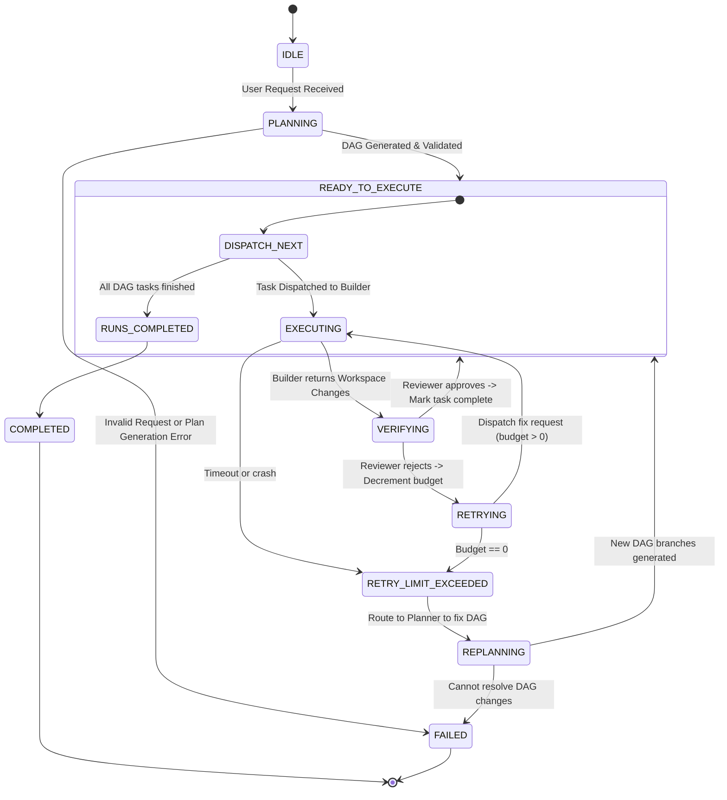

# Agent Communication & Verification Loop

This specification defines the communication protocol between the Planner, Builder, and Reviewer agents, ensuring deterministic execution and reliable self-correction.

---

## Agent Communication Protocol

Agents communicate by sending structured payloads over an event bus. No agent can directly call another agent's tools. Communication is decoupled through an orchestrator.

```
       +--------------+
       | Orchestrator |
       +───┬──────▲───+
           │      │
     Send  │      │  Return
     Task  │      │  Payload
           ▼      │
     +────────────┴─+
     | Agent (Worker) |
     +──────────────+
```

---

## Protocol Schemas

### 1. Planner to Orchestrator (DAG Payload)
The Planner outputs a JSON array defining the execution graph.

```json
{
  "session_id": "session-1029",
  "dag": [
    {
      "task_id": "task-001",
      "description": "Create connection pool module in src/db/pool.py",
      "dependencies": [],
      "verifiable_condition": "File src/db/pool.py exists and exports connection class",
      "verification_type": "unit_test"
    },
    {
      "task_id": "task-002",
      "description": "Integrate pool module into auth service in src/services/auth.py",
      "dependencies": ["task-001"],
      "verifiable_condition": "LSP compile diagnostics show 0 errors in src/services/auth.py",
      "verification_type": "lsp_compile"
    }
  ]
}
```

### 2. Orchestrator to Builder (Task Execution Request)
```json
{
  "task_id": "task-001",
  "description": "Create connection pool module in src/db/pool.py",
  "context": {
    "active_files": [],
    "symbols": [],
    "recent_edits_summary": ""
  }
}
```

### 3. Builder to Orchestrator (Task Completion Output)
The Builder reports structural edits and command results.

```json
{
  "task_id": "task-001",
  "status": "completed",
  "changes": [
    {
      "file_path": "src/db/pool.py",
      "type": "NEW",
      "sha256": "8a7c29e1f...e021a",
      "diff": "@@ -0,0 +1,24 @@\n+import psycopg2\n+..."
    }
  ],
  "logs": "Completed writing and verified basic syntax."
}
```

### 4. Reviewer to Orchestrator (Verification Output)
The Reviewer executes verification and either signs off or requests correction.

```json
{
  "task_id": "task-001",
  "status": "rejected",
  "reason": "Unit tests failed with exit code 1",
  "diagnostics": {
    "errors": [
      {
        "file_path": "src/db/pool.py",
        "line": 12,
        "column": 4,
        "message": "NameError: name 'psycopg2' is not defined",
        "severity": "ERROR"
      }
    ],
    "test_logs": "ImportError: No module named 'psycopg2' during test execution."
  }
}
```

---

## Execution Model & Process Isolation

To ensure stability, scalability, and language independence, the system implements an **Asynchronous Process Isolation Model** combined with a loop orchestrator.

```
┌────────────────────────────────────────────────────────┐
│                      Orchestrator                      │
└───────────────────────────┬────────────────────────────┘
                            │ (stdin/stdout pipes)
      ┌─────────────────────┼─────────────────────┐
      ▼                     ▼                     ▼
┌───────────┐         ┌───────────┐         ┌───────────┐
│  Planner  │         │  Builder  │         │  Reviewer │
│ (Process) │         │ (Process) │         │ (Process) │
└───────────┘         └───────────┘         └───────────┘
```

1.  **Process Separation**: Each agent runs as a separate process or container (e.g., Python sub-process, node worker, or Docker runtime). They do not share memory or file descriptors directly.
2.  **IPC Interface**: Communication is achieved via standard streams (`stdin` / `stdout`) writing JSON-RPC payloads, or over a local TCP loopback port (e.g., standard WebSocket server managed by the Orchestrator).
3.  **Timeout Limits**: Every agent execution run is bound by a strict timeout (e.g., Builder maximum run time of 300 seconds). If exceeded, the Orchestrator kills the subprocess, registers a `TIMEOUT` failure, and decrements the task budget.

---

## Event Routing & Python Interface Class Skeletons

Below is the concrete definition of the Event Bus and Agent abstractions to be implemented in Phase 1.

```python
import asyncio
import json
import time
from typing import Callable, Dict, List, Optional
from dataclasses import dataclass, asdict

@dataclass
class Event:
    event_id: str
    event_type: str       # "TASK_PLANNED", "TASK_DISPATCHED", "TASK_COMPLETED", "TASK_REJECTED"
    sender: str           # "orchestrator", "planner", "builder", "reviewer"
    recipient: str        # "orchestrator", "planner", "builder", "reviewer", "all"
    payload: dict
    timestamp: float = time.time()

    def serialize(self) -> str:
        return json.dumps(asdict(self))

    @classmethod
    def deserialize(cls, data: str) -> "Event":
        obj = json.loads(data)
        return cls(**obj)


class EventBus:
    """An asynchronous, in-memory publish-subscribe event routing engine."""
    def __init__(self):
        self._subscribers: Dict[str, List[Callable[[Event], asyncio.Future]]] = {}

    def subscribe(self, event_type: str, callback: Callable[[Event], asyncio.Future]):
        if event_type not in self._subscribers:
            self._subscribers[event_type] = []
        self._subscribers[event_type].append(callback)

    async def publish(self, event: Event):
        if event.event_type not in self._subscribers:
            return
        
        # Dispatch callbacks concurrently
        tasks = []
        for callback in self._subscribers[event.event_type]:
            if event.recipient == "all" or event.recipient == callback.__self__.name:
                tasks.append(callback(event))
        
        if tasks:
            await asyncio.gather(*tasks)


class BaseAgent:
    """Base definition for platform agents communicating via the event bus."""
    def __init__(self, name: str, event_bus: EventBus):
        self.name = name
        self.event_bus = event_bus

    async def handle_event(self, event: Event):
        raise NotImplementedError("Agents must implement handle_event")

    async def send_event(self, event_type: str, recipient: str, payload: dict):
        event = Event(
            event_id=f"{self.name}-{int(time.time() * 1000)}",
            event_type=event_type,
            sender=self.name,
            recipient=recipient,
            payload=payload
        )
        await self.event_bus.publish(event)
```

---

## Orchestrator State Machine Specification

The orchestrator operates on a deterministic State Machine to guide the lifecycle of a user request.



### Transition Verification Rules

| Target State | Initial State | Trigger Condition | Side Effect |
| :--- | :--- | :--- | :--- |
| **PLANNING** | IDLE | `Event("REQUEST_SUBMITTED")` | Start context OS retrieval of project metadata. |
| **EXECUTING** | READY_TO_EXECUTE | Task in DAG has all dependencies resolved | Build active file buffers; dispatch task payload to Builder process. |
| **VERIFYING** | EXECUTING | `Event("TASK_COMPLETED")` | Lock workspace write access; generate branch git diff; run Reviewer process. |
| **RETRYING** | VERIFYING | `Event("TASK_REJECTED")` and `budget > 0` | Set current task state to `correcting`; package lint errors. |
| **REPLANNING** | RETRYING | `Event("TASK_REJECTED")` and `budget == 0` | Send full history of failed edits and reviewer diagnostics to Planner. |
| **RUNS_COMPLETED**| READY_TO_EXECUTE | All tasks in DAG state match `completed` | Commit changes to main git workspace; save session to Working Memory. |

---

## Self-Correction Loop Logic

This Python routine illustrates the state management and correction logic implemented in the Orchestrator's execution loop:

```python
class TaskTracker:
    def __init__(self, task_id: str, budget: int = 3):
        self.task_id = task_id
        self.budget = budget
        self.status = "todo"
        self.attempts = []

class LoopOrchestrator:
    def __init__(self, event_bus: EventBus):
        self.event_bus = event_bus
        self.task_registry: Dict[str, TaskTracker] = {}
        self.event_bus.subscribe("TASK_COMPLETED", self.on_task_completed)
        self.event_bus.subscribe("TASK_REJECTED", self.on_task_rejected)

    async def on_task_completed(self, event: Event):
        task_id = event.payload["task_id"]
        tracker = self.task_registry[task_id]
        
        # Forward changes immediately to Reviewer for verification
        await self.event_bus.publish(Event(
            event_id=f"orch-{task_id}-verify",
            event_type="VERIFY_REQUEST",
            sender="orchestrator",
            recipient="reviewer",
            payload={
                "task_id": task_id,
                "changes": event.payload["changes"],
                "verifiable_condition": event.payload.get("verifiable_condition")
            }
        ))

    async def on_task_rejected(self, event: Event):
        task_id = event.payload["task_id"]
        tracker = self.task_registry[task_id]
        tracker.budget -= 1
        
        if tracker.budget > 0:
            # Trigger self-correction: send back to Builder
            print(f"Task {task_id} rejected. Retries left: {tracker.budget}. Triggering self-correction.")
            await self.event_bus.publish(Event(
                event_id=f"orch-{task_id}-retry",
                event_type="TASK_DISPATCHED",
                sender="orchestrator",
                recipient="builder",
                payload={
                    "task_id": task_id,
                    "description": f"FIX ERROR: {event.payload['reason']}",
                    "context": {
                        "errors": event.payload.get("diagnostics", {}),
                        "previous_changes": event.payload.get("changes", [])
                    }
                }
            ))
        else:
            # Budget exhausted: trigger Replanning / Failure
            tracker.status = "failed"
            print(f"Task {task_id} failed completely. Triggering replanning phase.")
            await self.event_bus.publish(Event(
                event_id=f"orch-{task_id}-replan",
                event_type="REPLAN_REQUEST",
                sender="orchestrator",
                recipient="planner",
                payload={
                    "failed_task_id": task_id,
                    "reason": event.payload["reason"],
                    "diagnostics": event.payload.get("diagnostics", {})
                }
            ))
```

