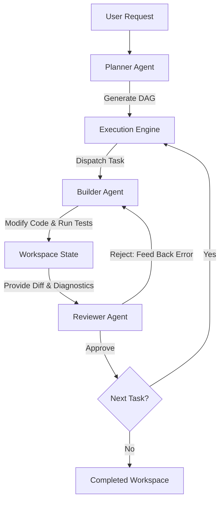

# Refined Local AI Agent Architecture Roadmap

This document expands the 12-phase roadmap into concrete implementation specifications, highlighting target technologies, architectural challenges, and engineering decisions required to build the platform.

---

## Phase 1 — Stable Multi-Agent Foundation
Establish three core agents running on a strict event-driven state machine with JSON-RPC or typed JSON schemas to enforce structural separation.

### Agent Specifications
*   **Planner**: 
    *   *Inputs*: User requests, project directory maps, open issues.
    *   *Outputs*: A strict Directed Acyclic Graph (DAG) of execution steps. Each node has a `verifiable_condition` and a list of `required_resources`.
    *   *Constraints*: No code editing tools in system prompt or tool registration.
*   **Builder**:
    *   *Inputs*: Sub-tasks from the Planner DAG.
    *   *Tools*: File reads/writes, grep search, terminal commands, AST inspect.
    *   *Termination*: Runs continuously until the current task's `verifiable_condition` returns success, or its execution budget (token count/tool call count) is exhausted.
*   **Reviewer**:
    *   *Inputs*: Planner DAG, Builder's workspace diff, build/test logs.
    *   *Tools*: LSP diagnostic execution, linter outputs, test runners.
    *   *Failure loop*: If verification fails, Reviewer generates a structural feedback payload (containing error logs, failing lines, diagnostics) and passes it back to the Builder, decrementing the retry budget.



---

## Phase 2 — Software-Level MoE (The Router)
Instead of invoking a single heavy model, implement a fast, rule-and-classifier-based routing layer to select the optimal model.

### Hardware-Aware Decision Tree
The routing decision is computed dynamically before each LLM call based on the following algorithm:

1.  **Request Classification**: Run a lightweight classifier (e.g., a regex heuristic or a 1.5B model like Qwen2.5-Coder-1.5B) to tag the request category (`exploratory`, `refactoring`, `testing`, `verification`, `planning`).
2.  **Complexity Estimation**: Evaluate request size, file counts, and dependency depth.
3.  **Hardware Sensing**: Query GPU VRAM via NVML (Nvidia Management Library) or `nvidia-smi` parser.
4.  **Route Selection Matrix**:
    *   *Low VRAM (<8GB)*: Offload planning and heavy coding to external API/quantized models; run fast coding on quantized local 7B models.
    *   *High VRAM (>24GB)*: Keep multiple models loaded in VRAM concurrently (e.g., Qwen2.5-Coder-7B-Instruct for Builder, DeepSeek-R1-Distill-Qwen-14B for Planner/Reviewer).
    *   *Fallback*: Use serverless local engines (e.g., Llama.cpp / Ollama) with dynamic model loading and context shifting.

---

## Phase 3 — Context OS
A stateless context assembly engine that compiles the prompt for each agent call. It decouples state management from the LLM.

### Context Composition
The Context OS intercepts agent calls and builds prompts containing:
1.  **System Prompt**: The static role definition (Planner, Builder, Reviewer).
2.  **Environment State**: Current OS, pathing, workspace root, language server status.
3.  **Dynamic Context Block**:
    *   AST representation of modified files.
    *   LSP diagnostic messages for current compile errors.
    *   Specific API references gathered in Phase 5.
4.  **Episodic Memory**: Relevant similar code fixes retrieved in Phase 4.

---

## Phase 4 — Memory Architecture
Memory is divided into three tiers with strict schemas and storage mediums.

| Memory Tier | Lifetime | Technology | Contents |
| :--- | :--- | :--- | :--- |
| **Working Memory** | Active Session | SQLite (In-Memory) | Active edits, terminal output buffer, active task node in DAG, lint history. |
| **Project Memory** | Project Lifetime | Obsidian Vault (Markdown) | Architectural design documents, API surface maps, conventions, team choices. |
| **Long-Term Memory** | Global | Vector DB (e.g., Qdrant / LanceDB) | Vector-embedded historical code diffs, successful resolutions of complex bugs. |

---

## Phase 5 — Retrieval Engine
Avoid high context costs by using hybrid search (BM25 + Semantic) combined with dependency resolution.

```
                  +------------------------+
                  |      User Query        |
                  +-----------+------------+
                              |
              +---------------+---------------+
              |                               |
     [Keyword Search]                [Semantic Search]
       (BM25/FTS5)                     (BGE-M3 Embed)
              |                               |
              +---------------+---------------+
                              |
                              v
                      [Hybrid Reranking]
                     (Local Cross-Encoder)
                              |
                              v
                  [Dependency Resolution]
                (AST Import Graph Traversal)
                              |
                              v
                 [Context OS Prompt Builder]
```

### Retrieval Heuristics
1.  **Semantic Search**: Query vector database using a local embedding model (e.g., `bge-m3` or `nomic-embed-text`) over chunked project files.
2.  **AST Dependency Traversal**: If file `A.py` is retrieved, run a fast AST parser (e.g., Tree-sitter) to find imported modules/files (`B.py`, `C.py`). Retrieve their public API signatures (class/function headers) and add them to context automatically.
3.  **Reranking**: Merge keyword and semantic matches using Reciprocal Rank Fusion (RRF), then trim using a lightweight cross-encoder.

---

## Phase 6 — Context Compression
Prevent context window bloat by running an asynchronous summarization job when conversations reach target size thresholds.

*   **Extraction Rule**: Convert chat histories into declarative markdown facts:
    *   *Decision*: Why did we use library X instead of Y?
    *   *Rationale*: Performance characteristics or bug workarounds.
    *   *Affected Files*: Exact list of file paths.
*   **Compression Target**: 10 pages of conversational history must compress to a <500-token summary object stored in Working Memory, freeing up context for raw file buffers.

---

## Phase 7 — Semantic Cache
Avoid running reasoning models on queries that have already been resolved.

*   **Key generation**: Normalize code queries by stripping comments, formatting variables, and resolving them to canonical AST paths. Hash the normalized query.
*   **Invalidation Matrix**:
    *   File watch events on the cached component's directory invalidate the cached response.
    *   Dependency upgrades (detected via lockfile changes) invalidate API cache.

---

## Phase 8 — Hierarchical Project Maps
Before inspecting files, the agent consumes a nested representation of the project workspace.

### Map Specification
*   **Level 0 (Global)**: Package structures, entry points (`main.py`, `index.js`), build configurations (`Makefile`, `package.json`, `Cargo.toml`).
*   **Level 1 (Module-Level)**: Exported classes, functions, and import/export lists for each module.
*   **Level 2 (Symbol-Level)**: Function signatures, docstrings, type annotations, and structural fields. No implementation code is stored at this level.

---

## Phase 9 — Incremental Indexing
Maintain indexes with zero redundant computations.

*   **Implementation**: A background watcher service (e.g. `chokidar` or `watchdog`) observes the workspace.
*   **Indexing Protocol**:
    1.  File Modified: Compute SHA-256 hash. If it matches the index database, skip. Otherwise, parse AST, update project map, re-generate vector embeddings for changed chunks, and write to database.
    2.  File Deleted: Remove corresponding rows in vector database and symbol tables.
    3.  Dependency File Changed (e.g., `poetry.lock`, `package-lock.json`): Trigger a full background scan of direct dependencies.

---

## Phase 10 — Agent-Specific Memory
Ensure models are fed only their specialized contexts to minimize attention dilution.

```
                     +----------------------------+
                     |         Context OS         |
                     +-----+----------------+-----+
                           |                |
         +-----------------+                +-----------------+
         |                                                    |
         v                                                    v
+------------------+                                 +------------------+
|  Planner Memory  |                                 |  Builder Memory  |
+------------------+                                 +------------------+
| - Roadmap DAG    |                                 | - Active Edits   |
| - Architecture   |                                 | - Diff States    |
| - Open Issues    |                                 | - Tool Results   |
+------------------+                                 +------------------+
```

---

## Phase 11 — Adaptive Context Budgets
Implement strict dynamic budget allocation to guarantee models do not exceed their physical limits or hit context degradation zones.

### Token Budget Allocator
```python
def allocate_context(model_limit, current_task, active_files, diagnostics, architecture, memory, history):
    # Core system resources are guaranteed first
    tokens = {
        "system": compile_system_prompt(),
        "task": current_task,
        "diagnostics": diagnostics
    }
    remaining = model_limit - sum(tokens.values())
    
    # Active files get next priority
    tokens["active_files"] = limit_tokens(active_files, priority="high", budget=remaining * 0.50)
    remaining -= tokens["active_files"]
    
    # Architecture and memory
    tokens["architecture"] = limit_tokens(architecture, budget=remaining * 0.40)
    tokens["memory"] = limit_tokens(memory, budget=remaining * 0.40)
    remaining -= (tokens["architecture"] + tokens["memory"])
    
    # Leftovers go to conversational history (most heavily compressed)
    tokens["history"] = limit_tokens(compress(history), budget=remaining)
    return tokens
```

---

## Phase 12 — Continuous Improvement
Track performance telemetry to refine agent configurations and routing weights automatically over time.

### Tracked Telemetry Metrics
1.  **Execution Efficiency**: ratio of tools called to successful task resolution.
2.  **Review Failure Rate**: count of builder edits rejected by the reviewer per unit task.
3.  **Token Efficiency**: total input/output tokens consumed per resolved issue.
4.  **Routing Accuracy**: cache hit rates and Latency vs. Success tradeoffs.
